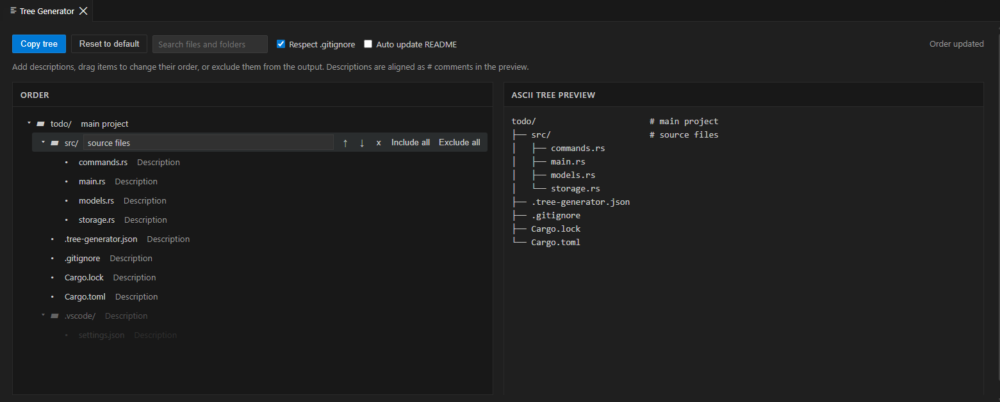

# Tree Generator

Tree Generator is a VS Code extension for visually editing a project tree and keeping it in a Markdown document.



```text
tree-generator/
├── src/                 # Extension source
│   ├── extension.ts     # Extension entry point
│   └── treeGenerator.ts # Tree renderer
├── package.json         # Extension manifest
└── README.md
```

## Features

- Directory-first alphabetical scanning with `.gitignore` support.
- Drag-and-drop ordering, descriptions, and manual exclusions.
- Search and directory-wide include or exclude actions.
- Undo and redo for tree editing, plus per-directory reset.
- Automatic refresh when files, folders, or ignore files change.
- Unicode or ASCII output with an optional maximum depth.
- Output settings and Markdown setup diagnostics in the Webview.
- Tree-only exclusions through a root `.tree-generatorignore` file.
- Project metadata persistence in `.tree-generator.json`.
- Multi-root workspace folder selection.

## Quick Start

1. Install [Tree Generator](https://marketplace.visualstudio.com/items?itemName=dldyou.tree-generator-dldyou) and open a workspace.
2. Run `Tree Generator: Open Tree Editor` from the Command Palette.
3. Edit the tree, configure the output, then copy the preview or enable automatic Markdown updates.

Use **Set up Markdown** in the editor to create the target file or append the required tree block. The generated block has this form:

````md
<\!-- tree-generator:start -->

```text
project/
└── README.md
```

<\!-- tree-generator:end -->
````

Only the content between the markers is replaced.

## Settings

| Setting                           | Default     | Description                                            |
| --------------------------------- | ----------- | ------------------------------------------------------ |
| `tree-generator.respectGitignore` | `true`      | Apply root and nested `.gitignore` rules.              |
| `tree-generator.readmePath`       | `README.md` | Markdown target relative to the workspace folder.      |
| `tree-generator.autoUpdateReadme` | `true`      | Update the marked block when the tree changes.         |
| `tree-generator.outputStyle`      | `unicode`   | Use `unicode` or `ascii` tree characters.              |
| `tree-generator.maxDepth`         | `-1`        | Maximum depth; `-1` is unlimited and `0` is root only. |

## CLI

```sh
tree-generator print [workspace]
tree-generator write [workspace]
tree-generator check [workspace]
```

Options: `--include-gitignored`, `--respect-gitignore`, `--readme <path>`, `--style <unicode|ascii>`, and `--max-depth <depth>`.

Requires VS Code 1.120.0 or later. See [CHANGELOG.md](CHANGELOG.md) for release history.
